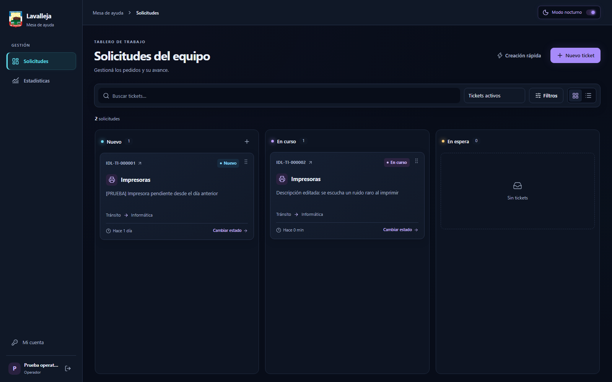
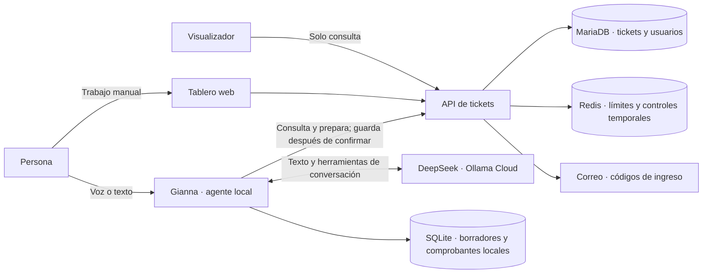

# Gianna · Asistente de voz y mesa de ayuda

**Conversá, registrá pedidos y seguí su avance en un solo lugar.**

Gianna ayuda a gestionar solicitudes de la Intendencia de Lavalleja. Podés hablarle o escribirle para preparar un ticket, consultar uno existente o cambiar su estado. El equipo también dispone de un tablero de trabajo y de una pantalla para mostrar los pedidos activos.

> **¿Querés instalarlo en otro PC?** Empezá por la [guía de instalación rápida](docs/instalacion-rapida.md). Incluye los programas necesarios, los comandos para copiar y pegar y las soluciones a los problemas más comunes.

[Instalación](#instalación-rápida-en-windows) · [Arquitectura](#cómo-está-organizado) · [Tecnologías](#tecnologías-de-cada-parte) · [Uso diario](#uso-diario) · [Despliegue en servidor](#despliegue-en-un-servidor)



## Qué podés hacer

- **Conversar con Gianna:** explicar un problema con tus palabras, completar los datos y revisar el pedido antes de guardarlo. Admite confirmaciones dentro de frases, como «Sí, confirmo ese pedido»; una corrección requiere una nueva revisión.
- **Trabajar con tickets:** crear, editar, cambiar de estado, consultar el historial y ocultar o restaurar solicitudes según tus permisos.
- **Organizar el equipo:** usar el tablero por estados o la lista, buscar y filtrar, administrar usuarios y consultar estadísticas.
- **Mostrar el seguimiento:** abrir el visualizador en una pantalla de oficina; muestra los tickets activos y se actualiza periódicamente.

Las interfaces cuentan con diseño adaptable y modos claro y nocturno. El tablero utiliza acentos neón; el visualizador ofrece una presentación compacta para aprovechar el espacio disponible.

## Cómo está organizado

Pensalo como una oficina: **Gianna atiende**, **el tablero permite trabajar**, **el visualizador muestra lo que está pasando** y **la API lleva el registro oficial**. Una API es el punto por el que las aplicaciones consultan y guardan datos.



| Parte | Carpeta | Para qué sirve |
|---|---|---|
| Agente Gianna | [`agent/`](agent/README.md) | Escucha, conversa, prepara operaciones y maneja su propio navegador. |
| Tablero de trabajo | [`frontend/`](frontend/README.md) | Es la web donde el equipo gestiona las solicitudes. |
| Visualizador | [`visualizer/`](visualizer/README.md) | Es la web de seguimiento de tickets, de solo lectura. |
| Servidor de datos | [`backend/`](backend/README.md) | Verifica permisos, valida las operaciones y conserva los registros. |

**Docker inicia el tablero, el visualizador, la API y sus servicios.** Docker permite ejecutar esos programas con sus dependencias preparadas. **Gianna se instala en el PC que tiene el micrófono**, para acceder al audio y, si está disponible, a su GPU.

Gianna no guarda porque el modelo diga que guardó: la API debe devolver un comprobante. Las confirmaciones están asociadas a la persona, su sesión y la versión del pedido revisado. Si se modifica el pedido, hay que revisarlo de nuevo. El navegador muestra el borrador y permite tomar el control manual; la escritura del agente pasa por la API.

## Tecnologías de cada parte

No necesitás conocer estas herramientas para usar el sistema. Esta tabla explica qué función cumple cada una.

| Parte | Tecnologías principales | Explicación sencilla |
|---|---|---|
| Interfaces web | React 19, TypeScript 5.9 y Vite 7 | Construyen las pantallas y sus interacciones. |
| Apariencia | Tailwind CSS 4, DaisyUI 5 y Lucide | Definen colores, estilos, controles e íconos. |
| Datos en las webs | TanStack Query, Axios y Zustand | Consultan el servidor y mantienen actualizada la interfaz. |
| Formularios y tablero | React Hook Form, Zod y dnd-kit | Validan formularios y permiten mover tickets entre estados. |
| API | Python 3.12, Flask 3.1, SQLAlchemy y Alembic | Implementan las reglas del sistema y los cambios de la base de datos. |
| Ingreso y permisos | JWT, Argon2 y códigos por correo | Protegen las sesiones y las contraseñas; distinguen administradores, operadores y visualizadores. |
| Almacenamiento central | MariaDB 11.4 y Redis 7.4 | Guardan los tickets, usuarios y controles temporales. |
| Correo de desarrollo | Mailpit | Permite leer los códigos de ingreso sin configurar un proveedor de correo. |
| Servicio del agente | FastAPI, Uvicorn y Pipecat | Conectan la consola de Gianna con la conversación y el audio. |
| Audio en el navegador | WebRTC | Lleva el micrófono y la voz entre el navegador y Gianna. |
| Reconocimiento de voz | Whisper large-v3-turbo, faster-whisper y CTranslate2 | Convierten lo que decís en texto. |
| Detección y limpieza de audio | RNNoise, Silero y SmartTurn | Reducen ruido y detectan cuándo hablás y cuándo terminás una frase. |
| Voz de Gianna | Piper con Daniela, español de Argentina | Convierte las respuestas en voz en el propio equipo. |
| Conversación y herramientas | DeepSeek mediante Ollama Cloud | Interpreta pedidos, usa herramientas de consulta y prepara las operaciones. |
| Navegador y datos del agente | Playwright, SQLite y keyring | Abren el navegador propio, conservan borradores/comprobantes y protegen credenciales cuando el sistema lo permite. |
| Instalación y verificación | Docker Compose, uv, npm, pytest, Vitest, Playwright y GitHub Actions | Instalan versiones fijadas y verifican el funcionamiento del proyecto. |

Las versiones concretas están fijadas en `agent/uv.lock`, los `package-lock.json`, los requisitos Python del backend y las imágenes de Docker. Los modelos de audio tienen un manifiesto con revisiones y huellas de verificación en [`agent/contracts/model-manifest.lock.json`](agent/contracts/model-manifest.lock.json).

## Instalación rápida en Windows

Necesitás **Git, Docker Desktop con motor Linux, Python 3.12, Node 22.23.3 y uv**. Para conversar con Gianna también necesitás micrófono, conexión a Internet y una clave de Ollama Cloud. La [guía paso a paso](docs/instalacion-rapida.md) enlaza los instaladores y explica la elección entre GPU y CPU.

Abrí PowerShell en la carpeta donde quieras guardar el proyecto y ejecutá:

```powershell
git clone https://github.com/NebyX1/agente-gianna-dashboard.git
cd agente-gianna-dashboard
python scripts/init-local.py
docker compose --profile development up -d --build --wait
docker compose exec backend flask --app wsgi seed-catalogs
docker compose exec backend flask --app wsgi create-admin
```

El script crea la configuración local con secretos nuevos. `seed-catalogs` carga los catálogos iniciales. `create-admin` pide el correo, nombre y contraseña de tu administrador: **no hay una contraseña universal**. La contraseña debe tener al menos 12 caracteres y no se muestra mientras la escribís.

Estos pasos de configuración son para la primera instalación. El script se niega a reemplazar un `.env` existente, para conservar sus secretos. Los tickets permanecen en un volumen de Docker al detener y volver a iniciar el sistema.

| Qué abrir | Dirección de la instalación habitual |
|---|---|
| Tablero y administración | [http://localhost:5173](http://localhost:5173/tickets) |
| Visualizador | [http://localhost:5174](http://localhost:5174/pantalla) |
| Códigos de ingreso en Mailpit | [http://localhost:8025](http://localhost:8025) |
| Estado de la API | [http://localhost:5000/readyz](http://localhost:5000/readyz) |
| Consola de Gianna, una vez iniciada | [http://127.0.0.1:7860](http://127.0.0.1:7860) |

`localhost` significa **este mismo PC**. Esta configuración está pensada para uso local. Mailpit recibe los correos de prueba; no los envía a una casilla externa. Para completar el ingreso, copiá el código que aparece allí.

### Instalar e iniciar Gianna

Desde la raíz del proyecto:

```powershell
powershell -NoProfile -ExecutionPolicy Bypass -File .\agent\scripts\setup.ps1
notepad .\agent\.env
```

El instalador prepara Python, Chromium, la consola y los modelos de audio. La primera descarga ocupa varios GB y puede demorar. Conserva un `.env` que ya exista. En `agent/.env`, completá `OLLAMA_API_KEY` con tu clave personal; el modelo configurado es `deepseek-v4.1-flash:cloud`. No hace falta instalar un servidor Ollama local.

El perfil de voz predeterminado usa **GPU NVIDIA con CUDA**. Si ese PC no tiene una GPU compatible, configurá el modo **CPU** explicado en la guía antes de iniciar. CPU usa el mismo modelo, pero puede responder más lento.

```powershell
cd agent
.\.venv\Scripts\python.exe -m gianna doctor
powershell -NoProfile -ExecutionPolicy Bypass -File .\scripts\start.ps1
```

`doctor` comprueba la configuración y los componentes necesarios. Ejecutalo con Gianna cerrada. Al iniciar se abre un navegador propio: **iniciá sesión en su pestaña de tickets**, abrí la consola y presioná **Conectar micrófono**. Permití el acceso al micrófono cuando el navegador lo solicite. El medidor debe reaccionar al hablar.

## Uso diario

1. Abrí Docker Desktop. Desde la raíz del proyecto, ejecutá `docker compose --profile development up -d --wait`.
2. Iniciá Gianna con `powershell -NoProfile -ExecutionPolicy Bypass -File .\agent\scripts\start.ps1` e ingresá en su navegador de tickets si te lo pide.
3. Conectá el micrófono y decí, por ejemplo: **«Gianna, registrá un pedido de Sociales: necesitan cambiar las hojas de una impresora»**.
4. Completá los datos que falten, revisá lo preparado y confirmá. El resultado guardado queda visible en tickets y en el comprobante de la operación.

Podés trabajar directamente desde el tablero aunque Gianna esté cerrada. Desde Administración se crean usuarios con los roles apropiados; el rol de visualizador no tiene permiso para modificar tickets.

Para cerrar: usá **Cerrar Gianna** en la consola y ejecutá `docker compose down` desde la raíz. **No agregues `-v`**: esa opción elimina los volúmenes y sus datos.

## Qué se copia a otro PC y dónde quedan los datos

Clonar el repositorio copia **el programa**, no los usuarios, tickets, claves ni modelos descargados de una instalación existente. Una instalación nueva empieza con su propia configuración y base de datos. Para trasladar los registros existentes, necesitás una copia de seguridad de MariaDB y su restauración, explicadas en la [guía de despliegue](docs/coolify.md).

Los datos locales de Gianna se guardan normalmente en `%LOCALAPPDATA%\Gianna` en Windows, fuera del código. Los tickets y usuarios centrales viven en MariaDB, dentro del volumen de Docker. Las claves, archivos `.env`, bases locales, perfiles de navegador, grabaciones, modelos descargados y cachés de instalación quedan fuera de Git.

El micrófono y la voz se procesan localmente. **La conversación usa Internet**: el texto, el contexto y los resultados necesarios para responder se envían al modelo de Ollama Cloud. No es una solución totalmente desconectada. Los detalles están en [operación y privacidad](agent/docs/operations.md).

## Despliegue en un servidor

Para que varias personas usen las webs desde otros equipos, desplegá **API, tablero y visualizador**, junto con MariaDB y Redis, en un servidor. Configurá dominios con HTTPS, las direcciones públicas de las webs y un proveedor SMTP real para los códigos de ingreso. MariaDB y Redis deben permanecer en la red privada del servidor.

La [guía de Coolify](docs/coolify.md) detalla variables, construcción, comprobaciones de salud, actualizaciones y copias de seguridad. Gianna sigue ejecutándose en el puesto con micrófono: sus variables `GIANNA_TICKETS_API` y `GIANNA_TICKETS_WEB` deben apuntar a los dominios desplegados, sin agregar `/api/v1`.

También hay instaladores de Gianna para Linux: `bash agent/scripts/setup.sh` y `bash agent/scripts/start.sh`. La comprobación de voz real de este proyecto se ha realizado en Windows; en otro sistema hay que verificar los dispositivos, las dependencias de audio y el resultado de `doctor`.

## Documentación y verificación

| Documento | Qué vas a encontrar |
|---|---|
| [Instalación rápida](docs/instalacion-rapida.md) | Configuración en otro PC y resolución de problemas. |
| [Arquitectura del sistema](docs/architecture.md) | Servicios, datos, permisos y decisiones del tablero/API. |
| [Arquitectura de Gianna](agent/docs/architecture.md) | Conversación, herramientas, confirmaciones y comprobantes. |
| [API](docs/api.md) | Consultas y operaciones disponibles para integrar el sistema. |
| [Despliegue en Coolify](docs/coolify.md) | Publicación en servidor y mantenimiento. |
| [Pruebas del sistema](docs/testing.md) y [pruebas de Gianna](agent/docs/testing.md) | Cómo verificar las webs, la API y el agente. |
| [Referencias y licencias de terceros](agent/docs/references.md) | Origen de modelos, componentes y recursos utilizados. |

GitHub Actions ejecuta controles de código, pruebas de Python y de las interfaces, comprobaciones de contratos, construcción de las webs y pruebas de integración. Las pruebas con modelos reales requieren un equipo separado con GPU, modelos y clave Cloud; el flujo correspondiente se inicia manualmente. Las pruebas con audio sintético sirven para detectar regresiones y no sustituyen una prueba con tu micrófono y tus parlantes.

> Los scripts `scripts/start-e2e.py` y los archivos de entorno E2E preparan datos descartables de pruebas. **No los uses para iniciar tu instalación de trabajo**: el preparador reinicia su base de pruebas. Para el uso habitual seguí los comandos de instalación y uso diario de esta página.
