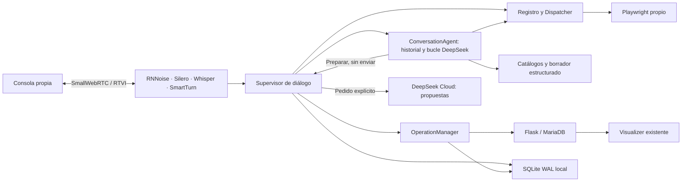

# Arquitectura

En modo Cloud, `ConversationAgent` conduce la conversación y la preparación con DeepSeek y llamadas nativas a herramientas. Recibe el historial real de usuario, respuestas y operaciones de preparación completadas, acotado a 72 eventos/48 KB y separado por actor y sesión. Recibe además los orígenes, destinos, categorías, borrador y campo pendiente. Una consulta sobre áreas actualiza el catálogo real; una selección posterior puede referirse al orden de la lista que Gianna acaba de decir. Los controles locales y las confirmaciones explícitas siguen en Supervisor. Las órdenes de creación y corrección del modo Cloud pasan por el mismo agente, sin volver a interpretar sus argumentos mediante otro clasificador de intención o extracción de citas.

`AgentTools` adapta las lecturas instaladas del registro y acciones locales de preparación. Valida esquemas, IDs existentes, destinos habilitados y propiedad del borrador. La descripción puede sintetizar los hechos de varios turnos: no se exige que sea una subcadena del último mensaje. create admite los mismos campos de catálogo que declara su esquema. Una selección conserva la descripción; seleccionar el mismo valor conserva también revisión y confirmación. Un origen desconocido conserva el relato y elimina cualquier selección anterior contradictoria. Las notas ya indicadas se preparan junto al cambio de estado, sin volver a pedirlas. Sólo OperationManager escribe después de validar actor, sesión, revisión, propiedad y confirmación.

El bucle admite ocho respuestas, doce llamadas y 90 segundos por turno; cada petición Cloud tiene hasta 45 segundos. Cuando propone sólo texto sin usar herramientas, una comprobación interna dentro del mismo bucle verifica que haya atendido el último pedido antes de emitirlo. Publica intención antes de invocar y conserva todos los intercambios completos, incluidos los que prepararon y leyeron una revisión. Cada llamada de un lote tiene resultado, aunque se omita después de presentar una revisión. Los fallos registran tipo, detalle, rondas y duración. Las búsquedas/historias aportan hasta diez elementos. Supervisor descarta respuestas tardías tras cambiar generación, actor o sesión. Un flujo que ya leyó una revisión termina el turno. Mientras hay un borrador, el comprobante anterior se presenta como tal y no acredita el cambio pendiente.

`agent/` tiene su propio Python 3.12 y React/TypeScript/Vite/Tailwind/DaisyUI. No importa componentes de frontend/ ni visualizer/. El contrato OpenAPI de tickets es una copia versionada, verificada contra la API al arrancar.

Las respuestas a una revisión tienen una ruta breve local para expresiones claras y una interpretación semántica con DeepSeek para las demás oraciones. `ReviewInterpreter` devuelve intención/confianza con esquema validado y plazo de 12 segundos; no ejecuta herramientas ni escribe. Supervisor comprueba la misma generación, revisión, actor, sesión, hash, propiedad y vigencia antes y después del modelo, y vuelve a validarlos en commit. Negaciones, condiciones, correcciones y consultas no se convierten en aprobaciones por contener «confirmo». Retomar un borrador debe ejecutar `conversation_control/resume` y presentar una revisión vigente.

La interrupción acústica se atiende inmediatamente después de Silero, antes de STT. Envía una única interrupción prioritaria a Piper y al transporte de salida; no reinicia la captura ni las colas de reconocimiento o diálogo. El navegador silencia la reproducción al inicio del turno humano y la habilita al empezar una nueva respuesta. Los contextos TTS cancelados conservan su generación/época de salida para distinguirlos de una respuesta realmente vacía del proveedor. Un fallo de voz se informa como tal, sin pedir reconectar un micrófono sano; una respuesta posterior con audio elimina ese aviso.

RNNoise limpia la señal usada por Silero y SmartTurn. `RecognitionPreservingDenoise` conserva en memoria una FIFO del PCM original y lo empareja por cantidad de muestras con la salida del filtro/resampler. Whisper recibe ese PCM original para conservar consonantes débiles; el frame que llega a los detectores sigue limpio. La FIFO tiene un límite de dos segundos y se elimina al cerrar el transporte. Esto no guarda grabaciones.

Whisper recibe contexto de español rioplatense y vocabulario del sistema, confirmación, negación y corrección, ganancia acotada y un recorte de silencios exteriores con márgenes de 250 ms. No se recortan pausas interiores. Cada segmento conserva su evidencia; un turno combinado incorpora todas sus partes, en vez de atribuirle solamente el último segmento. [Diagnóstico de voz y confirmación](voice-confirmation-repair.md).

El Supervisor posee actor, sesión, turno, generación, borrador, confirmación y autoridad para hablar. La evidencia acústica puede detener audio sin cancelar el trabajo semántico. Sólo una transcripción final aceptada crea otra generación. La cola de diálogo cancela la consulta semántica anterior; una escritura reservada tiene su propia tarea y persiste aunque el interlocutor cambie de tema.

El Dispatcher valida esquema, capacidad disponible, estado, rol, plazo y presupuesto de 12 herramientas por turno. Las escrituras remotas se rechazan en ese Dispatcher: necesitan OperationManager. Los planes opcionales tienen hasta cuatro pasos, 60 segundos y como máximo una escritura final con recurso explícito. Aplicar un plan prepara esa escritura y exige una revisión/confirmación nueva.

OperationManager conserva intención antes de enviar y comprobante antes de anunciar éxito. El último control de propiedad y la reserva durable están en el mismo lock, sin `await` entre ellos. La credencial queda capturada para esa operación, sin guardarla en SQLite. Una respuesta vieja no puede hablar ni sustituir el borrador de otro turno o usuario; un recibo de su actor sigue siendo un hecho durable.

Los workers nativos de Whisper y Piper usan un thread y exclusión física. Cancelar el `await` no libera la inferencia nativa ni permite un segundo modelo en paralelo dentro de esa instancia. Las operaciones HTTP son asíncronas y no se realizan dentro de la transacción local.

Se tomaron patrones de Gianna Turismo para audio. La revisión de [Hermes Agent, commit 667b232535c343aaa78c2eba14aa5cf1e13decd8](https://github.com/NousResearch/hermes-agent/tree/667b232535c343aaa78c2eba14aa5cf1e13decd8), en particular `agent/conversation_loop.py` y `agent/turn_tool_round.py`, guía la conservación de llamadas/resultados completos y la separación entre razonamiento, ejecución y persistencia. Gianna mantiene un bucle propio acotado para voz; no instala ni importa el agente general de Hermes.

La superficie es una capacidad concreta de Playwright. Desktop, archivos, procesos y MCP se publican como no disponibles. La segunda aplicación de fixture demuestra el contrato público de provider/Dispatcher; no se afirma que exista control general de aplicaciones de escritorio.
